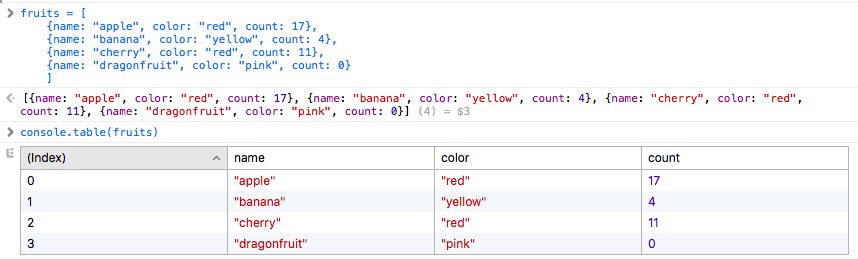

# Use `console.table()` in the web inspector for easy display of tabular information

In the Web Inspector, you can use `console.table()` to see a prettified, table view of tabular information – for example, an array of dictionaries.

It's fairly smart in what it can handle – for example, it can cope with missing fields in some rows of the array, and takes data in a variety of vaguely sensible formats.

The [MDN docs](https://developer.mozilla.org/en-US/docs/Web/API/Console/table) have lots of examples of the sort of data that it's able to render.

([source](https://twitter.com/joewalnes/status/705589644289769473))