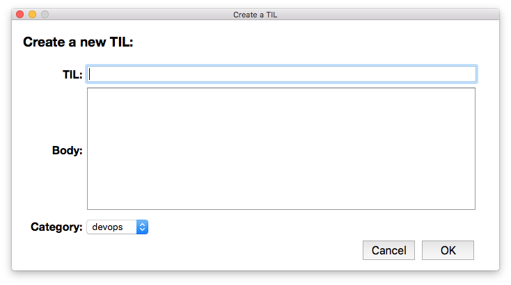

# Keyboard Maestro macro

I have a [Keyboard Maestro macro](http://www.keyboardmaestro.com/main/) that I use for creating new TIL entries.  It throws up a small HTML form that allows me to write the entries:

Once I click OK, the macro:

* Creates the new TIL file
* Updates the index in the README
* Creates a new commit in the Git repo

To use this macro, downloads the <a href="Add a new TIL.kmmacros">Add a new TIL.kmmacros</a> file, and change the `TILGitDir` variable to point to your copy of the repo.