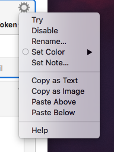

# Rename actions in Keyboard Maestro

Using the gear icon in the top right-hand corner of an action, you can rename it to something more descriptive than the generic action names.

I didn’t know this before, and it meant I was always writing very simple macros – after a while, the complicated macros became too hard to follow. This is going to make it much easier to write long macros.