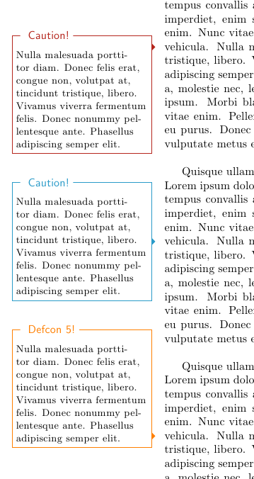

# Use marginnote and mdframed to create call-outs alongside your text

Using marginnote and mdframed, you can create nice call-outs alongside your text, which could contain supplemental information or the like:

I used this a while back for some of my maths notes – works reasonably well, but starts to fall over when you have lots of overlapping notes.

All the source code is on [TeX.SX](http://tex.stackexchange.com/a/120253/9668).