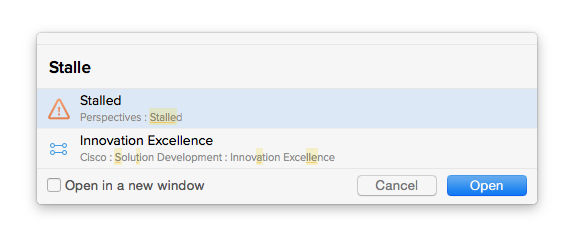

# Use ⌘+O to quickly access areas in OmniFocus

In OmniFocus 2, you can press ⌘+O to get the “Quick Open” window. You can start typing the name of a project, folder, context or perspective, and select based on partial name – sort of like fuzzy matching in Spotlight or Alfred.

It’s a fast way to navigate the app without leaving the keyboard.

([source](http://web.archive.org/web/20150215204836/http://simplicitybliss.com/blog/quick-open-in-omnifocus))